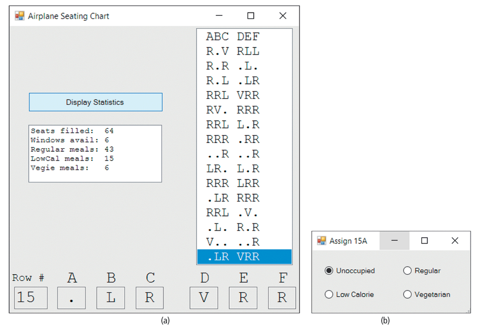

# Airline Seating Chart
Airplane Seating Chart An airplane has 15 rows (numbered 1 through 15), with six seats (labeled A, B, C, D, E, and F) in each row. Write a multiform program that keeps track of the seats that have been reserved and the type of meal requested by each passenger. The seating chart should be displayed in a list box with a line for each row. See Fig. (a). When the ticket agent clicks on the desired row in the list box, the row number and the status of the seats in the row should be displayed in seven read-only text boxes at the bottom of the form. When the agent clicks on one of the text boxes, a second form containing four option buttons labeled Unoccupied, Regular, Low Calorie, and Vegetarian should appear. See Fig. (b). Clicking on a radio button should close the second form and update both the text box and the row for that seat in the list box. Unoccupied seats are denoted with a period, and occupied seats are denoted with the first letter of their meal type. At any time, the agent should be able to request the number of seats filled, the number of window seats vacant, and the numbers of each type of meal ordered.

**Hint: Write one method to handle what happens when any seat label is clicked. Write one method to handle when any radio button is clicked.**

*Remember, when you pass a variable by reference, you are changing the original variable and not just a copy*

